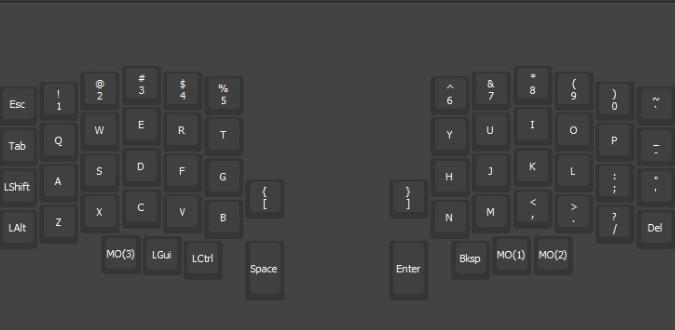

## Personal vial config for lily58 pro

Download the config file present in this repository and load it using [vial desktop configurator](https://get.vial.today/).
[Instagram post for the build](https://www.instagram.com/p/C6jBl97gV_l/?utm_source=ig_web_copy_link&igsh=MzRlODBiNWFlZA==)

### Layers
##### Base layer:

##### Layer 1:

##### Layer 2:

